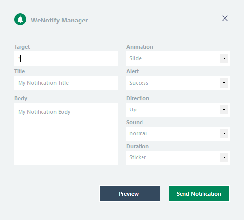
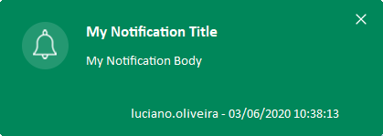
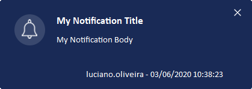
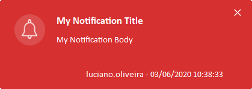
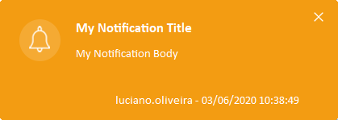

<!-- PROJECT LOGO -->
 

  

  <h3 align="center">WeNotify</h3>

  

    An beautiful Windows notification client
   
  WeNotify allows you send and receive important notifications absolutely easy.
   
  No dedicated server or Internet connection is required!
  

<!-- ABOUT THE PROJECT -->
### WeNotify Manager

### WeNotify Client

### Download

| Name | Version |
| ------ | ------ |
| WeNotify Manager | [1.2.0](https://github.com/luciano-work/WeNotify/releases/tag/1.2.0) |
| WeNotify Client | [1.1.0](https://github.com/luciano-work/WeNotify/releases/tag/1.1.0)  |
